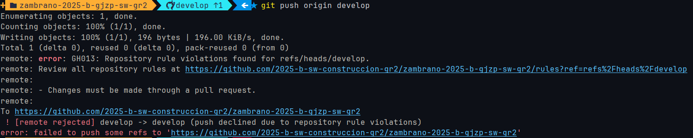
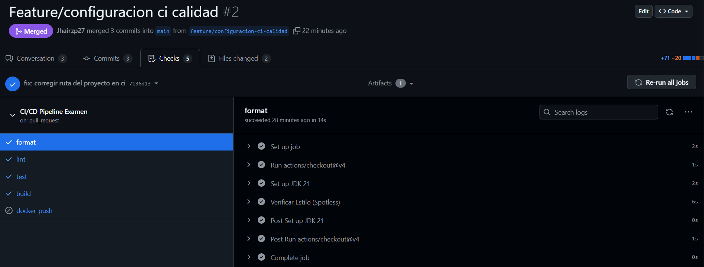
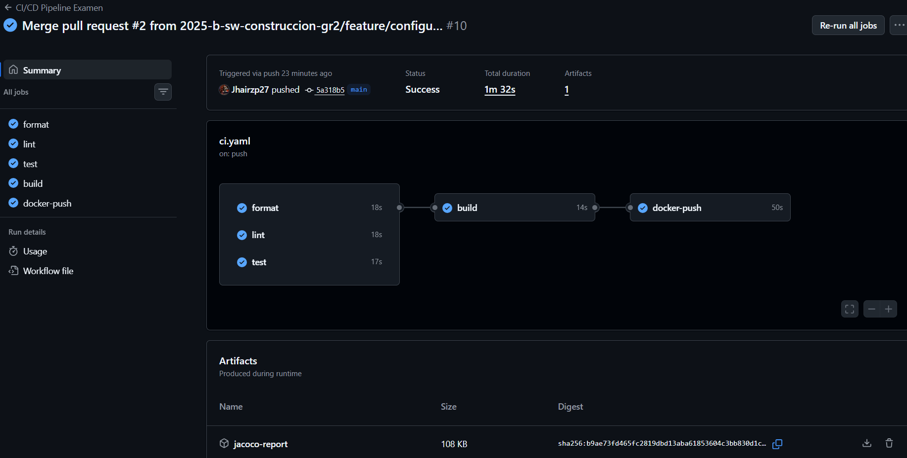
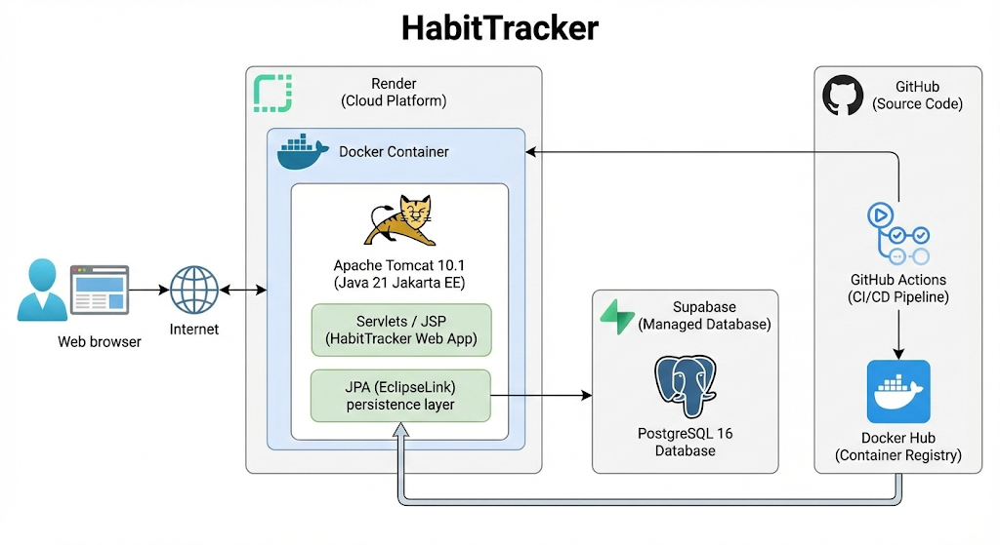
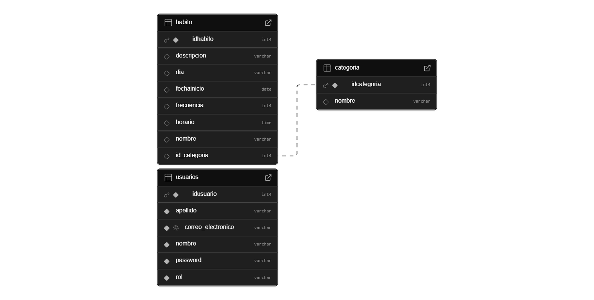

# 📅 HabitTracker - Sistema de Gestión de Hábitos


Aplicación web para el seguimiento y gestión de hábitos personales, desarrollada como proyecto final de la materia de Construcción de Software. Permite a los usuarios registrarse, crear hábitos, marcar su cumplimiento diario y visualizar su progreso.

---

## 🚀 Despliegue en la Nube (Demo)

El proyecto se encuentra desplegado y funcional en Render. Puedes acceder a través del siguiente enlace:

👉 **[Ver Aplicación en Vivo](https://habit-tracker-jf6y.onrender.com)**

> **Nota:** Al estar en el plan gratuito de Render, el servidor puede tardar unos **50-60 segundos en "despertar"** si ha estado inactivo. Por favor, ten paciencia en la primera carga.

---

## 📋 Credenciales de Prueba

Para facilitar la revisión, se ha configurado un usuario y administrador con datos precargados:

| Rol         | Usuario (Email)      | Contraseña |
|:------------|:---------------------|:-----------|
| **Admin**   | `jhair@ejemplo.com`  | `12354456` |
| **Usuario** | `adrian@ejemplo.com` | `12345678` |


---

## 🔄 CI/CD y Calidad de Software

Para garantizar la integridad del código, se ha implementado un flujo de trabajo basado en **GitFlow** con integración continua mediante **GitHub Actions**.

### 1. Protección de Ramas (Branch Protection)
La rama `develop` está protegida contra escritura directa. Cualquier intento de *push* sin pasar por un Pull Request es rechazado automáticamente por el servidor.

> *Evidencia de bloqueo al intentar push directo a develop:*


### 2. Verificación Automática (Pipeline)
Cada Pull Request dispara un pipeline de validación estricta que ejecuta:
* **Format:** Verificación de estilo de código (Spotless).
* **Lint:** Análisis estático de código (Checkstyle).
* **Tests:** Ejecución de pruebas unitarias y generación de reporte de cobertura (JaCoCo).
* **Build:** Compilación del proyecto para asegurar que no hay errores de sintaxis.

> *Evidencia de Pull Request con todos los controles exitosos:*


### 3. Ejecución del Workflow
Una vez aprobado el Merge, el sistema ejecuta el empaquetado final y, si es la rama `main` o `develop`, prepara los artefactos para despliegue.



---

## 🛠️ Arquitectura y Diseño

### Diagrama de Arquitectura
El sistema sigue una arquitectura MVC (Modelo-Vista-Controlador) utilizando Servlets y JSP, desplegado sobre un contenedor Docker con Tomcat 10.



### Modelo de Base de Datos
La persistencia se maneja con JPA (EclipseLink) conectado a una base de datos PostgreSQL alojada en Supabase.



---

## 💻 Tecnologías Utilizadas

* **Lenguaje:** Java 21 (LTS)
* **Framework Web:** Jakarta EE 10 (Servlets, JSP, JSTL)
* **Servidor de Aplicaciones:** Apache Tomcat 10.1.x
* **Base de Datos:** PostgreSQL 16 (vía Supabase)
* **ORM:** EclipseLink (JPA 3.1)
* **DevOps:**
    * **Docker:** Empaquetado "Multi-stage" para compilación y ejecución.
    * **GitHub Actions:** Pipeline CI/CD automatizado.
    * **Render:** Plataforma de despliegue (PaaS).

---

## ⚙️ Instalación y Ejecución Local

Si deseas correr el proyecto en tu máquina local utilizando Docker:

### Prerrequisitos
* Docker y Docker Compose instalados.
* Git.

### Pasos

1.  **Clonar el repositorio**
    ```bash
    git clone [https://github.com/TU_USUARIO/HabitTracker.git](https://github.com/TU_USUARIO/HabitTracker.git)
    cd HabitTracker
    ```

2.  **Construir la imagen Docker**
    ```bash
    docker build -t habit-tracker .
    ```

3.  **Ejecutar el contenedor**
    Necesitas pasar las variables de entorno para la base de datos (puedes usar una BD local o la de Supabase):
    ```bash
    docker run -p 8080:8080 \
      -e DB_URL="jdbc:postgresql://tu-host:5432/postgres" \
      -e DB_USER="tu_usuario" \
      -e DB_PASSWORD="tu_password" \
      habit-tracker
    ```

4.  **Acceder**
    Abre tu navegador en: `http://localhost:8080/HabitTracker`

---

## 🧪 Pruebas de Humo (Smoke Test)

Para verificar el correcto funcionamiento del sistema tras el despliegue:

1.  **Login:** Ingresar con las credenciales de prueba proporcionadas.
2.  **Persistencia:** Crear un nuevo hábito (ej: "Leer 10 minutos"). Cerrar sesión y volver a entrar para verificar que el dato persiste en Supabase.
3.  **Navegación:** Verificar que el listado de hábitos carga correctamente sin errores 500.

---

### Autores
* **Jhair Zambrano** - *Diagramado, Desarrollo y Despliegue* - [GitHub Profile](https://github.com/jhairzp27)
* **Gabriel Maldonado** - *Planning y Refinamiento* - [GitHub Profile](https://github.com/MaldonadoGabs)
* **Daniel Moncayo** - *Desarrollo y Despliegue* - [GitHub Profile](https://github.com/Daniel-Moncayo)